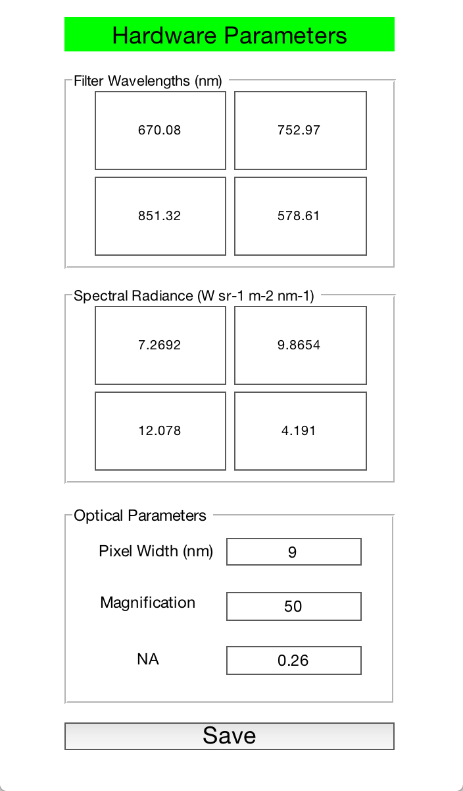

# MIRRORS 
v1.8.0

[](https://zenodo.org/badge/latestdoi/100439021)

MIRRORS is a Graphical User Interface (GUI) created using the Matlab© GUIDE© program. The software is designed to process .TIFF images produced by a multispectral imaging radiometry (MIR) system for temperature measurement of samples heated in a diamond anvil cell, similar to the one developed by [Campbell (2008)](http://doi.org/10.1063/1.2827513)[^1] and which has been copied at the School of Earth Sciences at the University of Bristol, UK [(Lord et al. 2014)](http://doi.org/10.1016/j.epsl.2014.09.046)[^2].

The GUI can work in live mode (during an experiment) or in post-processing mode, and performs both spatial and thermal calibrations on the data before producing maps of temperature, temperature error and image difference, i.e. the change in shape of the temperature field, based on the work presented in the Supplementary Information of [Briggs et al. (2017)](http://doi.org/10.1103/PhysRevB.95.054102)[^3]. The software also provides the user with an example Wien fit, peak temperature as a function of elapsed time, an image difference metric (also as a function of elapsed time), orthoganol temperature cross-sections centered on the peak pixel and finally emissivity as a function of temperature, as described in [Fischer & Campbell (2010)](http://doi.org/10.2138/am.2010.3463)[^4]. 

Since version 1.8.0, the software has been updated to allow the user to choose whether 3 or 4 colors are fitted, so that if one of the 4 monochromatic images has a very low signal to noise ratio, it can be ignored. This is especially useful at low temperatures. In additon, since version 1.8.0, the software now supports MIR systems based on either the original hardware design of [Campbell (2008)](http://doi.org/10.1063/1.2827513)[^1] in which the four images are focussed onto each quadrant of a single CCD camera, or more recent set-ups that use four separate, inexpensive, CMOS cameras. This approach means that the four separate images do not need to be recombined before focussing onto the cameras, dramatically reducing light loss, increasing signal to noise ratio and reducing the minimum temperature that can be accurately fitted.

The original release of MIRRORS is described in detail in [Lord & Wang (2018)](http://doi.org/10.1063/1.5041360)[^5].

[^1]:[Campbell, A. J. (2008). Measurement of temperature distributions across laser heated samples by multispectral imaging radiometry. Review of Scientific Instruments, 79(1), 015108.](http://doi.org/10.1063/1.2827513)

[^2]:[Lord, O. T., Wood, I. G., Dobson, D. P., Vočadlo, L., Wang, W., Thomson, A. R., et al. (2014). The melting curve of Ni to 1 Mbar. Earth and Planetary Science Letters, 408, 226–236.](http://doi.org/10.1016/j.epsl.2014.09.046)

[^3]:[Briggs, R., Daisenberger, D., Lord, O. T., Salamat, A., Bailey, E., Walter, M. J., & McMillan, P. F. (2017). High-pressure melting behavior of tin up to 105 GPa. Physical Review B, 95(5), 054102.](http://doi.org/10.1103/PhysRevB.95.054102)

[^4]:[Fischer, R. A., & Campbell, A. J. (2010). High-pressure melting of wustite. American Mineralogist, 95(10), 1473–1477.](http://doi.org/10.2138/am.2010.3463)

[^5]:[Lord, O. T., & Wang, W. (2018). MIRRORS: A MATLAB ®GUI for temperature measurement by multispectral imaging radiometry. Review of Scientific Instruments, 89(10), 104903](http://doi.org/10.1063/1.5041360)

## Required hardware

MIRRORS requires a multispectral imaging radiometry (MIR) system that produces either 

1. a single .TIFF file containing four monochromatic images of the laser heated spot to be analysed, each approximately centered on the centre pixel of one quadrant of the full image or

2. four separate .TIFF files, each containing a single image of the laser heated spot to be analysed, again approximately centered on the centre pixel of the sensor as long as the files are appended \_a, \_b, \_c and \_d. In this case, for live mode to be effective, all four images need to appear in the target directory almost simultaneously or they will be ignored and left unfitted.

Images can be of any resolution, aspect ratio and bit depth. The software performs a spatial calibration before stacking the four quadrants and so the centering does not need to be perfect. Each image must be at a different, precisely known wavelength.

The system needs a thermal calibration .TIFF image produced using a calibrated source of known spectral radiance and as before, consisting of four equal quadrants each illuminated by a monochromatic image of the calibration source.

Details of the MIR system as well as calibration methods can be found in Campbell et al. (2008) and Lord & Wang (2018).

## System compatibility

MIRRORS can be run from the MATLAB command line or as a standalone application on any machine running 64-bit Mac OS X or Windows. Note, support for 32-bit Windows machines ends at version 1.7.9; in that release, MIRRORS can still be run from the MATLAB command line on a 32-bit Windows machine, but the standalone app will not work. From version 1.8.0 onwards, MIRRORS uses functions not available in MATLAB 2014a, the last version compatible with 32-bit hardware and so cannot be run from the MATLAB command line on a 32-bit machine.

* [from v1.8.0](https://github.com/olivertlord/MIRRORS/tree/v1.7.9): For this version, MIRRORS has been tested and compiled on MATLAB R2022b on Mac OS X 12.6.3 Monterey with Apple Silicon and Windows 11 Home version 22H2 running in the Parallels Virtualisation platform (both 64-bit operating systems). The associated binaries have been produced from these versions of MATLAB. This version may not work correctly if run from the command line of an earlier version of MATLAB

* [from v1.7.9](https://github.com/olivertlord/MIRRORS/tree/v1.7.9): For this version MIRRORS has been tested on MATLAB R2021b on Mac OS X 11.5.2 Big Sur and Windows 10 (both 64-bit operating systems) and the associated binaries have been produced from this version of MATLAB. This version may not work correctly if run from the command line of an earlier version of MATLAB

* [v1.7.0](https://github.com/olivertlord/MIRRORS/tree/v1.7.0) to [v1.7.8](https://github.com/olivertlord/MIRRORS/tree/v1.7.8): These versions were written and tested on MATLAB R2014a (32-bit Windows 7) & R2018b (64-bit OS X 10.13 High Sierra) and the associated binaries have been produced from these versions of MATLAB. It will likely work on all versions after R2014a on Windows 7 and all versions after R2018b on OS X, but has not been explicity tested.

* [v1.6.16](https://github.com/olivertlord/MIRRORS/tree/1.6.16) and earlier: standalone binaries were not available, but otherwise compatibility is as for [v1.7.0](https://github.com/olivertlord/MIRRORS/tree/v1.7.0).

## Third party functions

MIRRORS uses two third-party functions (i.e. functions not provided by MathWorks and not written by me):[im2col3](https://uk.mathworks.com/matlabcentral/fileexchange/93040-im2col3)[^6] and [Tooltip Waitbar](https://uk.mathworks.com/matlabcentral/fileexchange/26284-tooltip-waitbar?s_tid=ta_fx_results)[^7]

[^6]:[Yury (2023). im2col3, GitHub. Retrieved April 25, 2023.](https://github.com/caiuspetronius/im2col3/releases/tag/v1.0)

[^7]:[Geoffrey Akien (2023). Tooltip Waitbar, MATLAB Central File Exchange. Retrieved April 25, 2023.](https://www.mathworks.com/matlabcentral/fileexchange/26284-tooltip-waitbar)

## Running MIRRORS from the Matlab command line

MIRRORS requires the Image Processing Toolbox, Signal Processing Toolbox and the Statistics and Machine Learning Toolbox to be installed.

Download the [source code](https://github.com/olivertlord/MIRRORS/releases/latest) as a .ZIP or .tar.gz file, and extract to your desired location. 

To run MIRRORS, open Matlab, navigate to the MIRRORS directory and then type `MIRRORS`

It is convenient to add the MIRRORS directory to the Matlab PATH. To do so, at the Matlab command prompt type:

```
location = userpath
location = location(1:end-1)
cd(location)
edit startup.m
```

If you are prompted to create `startup.m`, then do so. In the new .m file that opens in the Editor, add `addpath(genpath('~/MIRRORS'));` (where `~/MIRRORS` is the full path to your MIRRORS directory). Now, next time you start Matlab, MIRRORS will be on the Matlab PATH and you can run MIRRORS from any location.

## Running MIRRORS from a standalone app

The MIRRORS standalone application requires the Matlab Component Runtime to be installed on your local machine, which can be dowdloaded for free. The version of the MCR you require depends on your operating system and the version of MATLAB that was used to create the standalone app you are using. For [the current release](https://github.com/olivertlord/MIRRORS/releases/latest):

* `Mac OS X (64-bit):`	[MCR version 9.13 for Mac (64-bit)](https://ssd.mathworks.com/supportfiles/downloads/R2022b/Release/5/deployment_files/installer/complete/maci64/MATLAB_Runtime_R2022b_Update_5_maci64.dmg.zip)

* `Windows (64-bit) :`	[MCR version 9.14 for Windows (64-bit)](https://ssd.mathworks.com/supportfiles/downloads/R2023a/Release/1/deployment_files/installer/complete/win64/MATLAB_Runtime_R2023a_Update_1_win64.zip)

For version [v1.7.9](https://github.com/olivertlord/MIRRORS/tree/v1.7.9) you will need:

* `Mac OS X (64-bit):`	[MCR version 9.11 for Mac (64-bit)](https://ssd.mathworks.com/supportfiles/downloads/R2021b/Release/1/deployment_files/installer/complete/maci64/MATLAB_Runtime_R2021b_Update_1_maci64.dmg.zip)

* `Windows (64-bit) :`	[MCR version 9.11 for Windows (64-bit)](https://ssd.mathworks.com/supportfiles/downloads/R2021b/Release/1/deployment_files/installer/complete/win64/MATLAB_Runtime_R2021b_Update_1_win64.zip)

For versions [v1.7.0](https://github.com/olivertlord/MIRRORS/tree/v1.7.0) to [v1.7.8](https://github.com/olivertlord/MIRRORS/tree/v1.7.8) you will need:

* `Mac OS X (64-bit):`	[MCR version 9.5 for Mac (64-bit)](http://ssd.mathworks.com/supportfiles/downloads/R2018b/deployment_files/R2018b/installers/maci64/MCR_R2018b_maci64_installer.dmg.zip) 

* `Windows (32-bit) :`	[MCR version 8.3 for Windows (32-bit)](https://uk.mathworks.com/supportfiles/downloads/R2014a/deployment_files/R2014a/installers/win32/MCR_R2014a_win32_installer.exe)

* `Windows (64-bit) :`	[MCR version 8.3 for Windows (64-bit)](https://uk.mathworks.com/supportfiles/downloads/R2014a/deployment_files/R2014a/installers/win64/MCR_R2014a_win64_installer.exe)

Once the correct MCR is installed, simply download and extract MIRRORS.app.zip (Mac Os X) or download MIRRORS.exe (Windows) from [your chosen release](https://github.com/olivertlord/MIRRORS/releases/), move it to a location of your choosing and double click to launch MIRRORS.

## Testing your installation

To check your installation is working, a set of example data files are provided along with a text file containing expected numerical output. The example data can be [downloaded as a .zip archive](https://github.com/olivertlord/MIRRORS/releases/latest).

Run MIRRORS (from the Matlab command line or the standalone app) and click on the `run test` button. MIRRORS will ask you to point it to the folder containing the example data. MIRRORS will then perform 80 calculations on the three data files within using a variety of options. If successful, two new text files, `test_data` and `results` will appear. Inspect `results` in a text editor. It should look something like this:

```
       NaN	  -0.60000	   0.00000	   0.00000	   0.00000	   0.00000	   0.00000	       NaN	
       NaN	  -0.60000	   0.00000	   0.00000	   0.00000	   0.00000	   0.00000	   0.00000	
       NaN	  -0.60000	   0.00000	   0.00000	   0.00000	   0.00000	   0.00000	   0.00000	
       NaN	  -0.60000	   0.00000	   0.00000	   0.00000	   0.00000	   0.00000	       NaN	
       NaN	  -0.60000	   0.00000	   0.00000	   0.00000	   0.00000	   0.00000	   0.00000	
       NaN	  -0.60000	   0.00000	   0.00000	   0.00000	   0.00000	   0.00000	   0.00000
```

I.e. it should contain only zeros and NaN values. Note that this test can take many minutes to complete, but does not test live mode.

## Customising Mirrors for your system

Once MIRRORS is installed, you will need to set various hardware specific parameters to fit your system. To do this:

1. Click the ```Update Calibration Image``` button and select your current thermal calibration image, or four images, if you are in 4 camera mode.

2. Click the ```Update Hardware Parameters``` button. This will open a separate window (see screenshot below), listing various hardware specific constants. Change the values to match your system. The `Filter Wavelengths` and `Spectral Radiance` values are arranged graphically to mimic the quadrants of your CCD. If you are using a 4 camera setup, each camera must produce files appended with different letter from the list \_a, \_b, \_c or \_d where a = top left, b = top right, c = bottom left, d = bottom right of a stitched image represented by the quadrants in the hardware parameter window. Once updates are complete, click '''save''', the window will close and the values will be remembered by the software.

You will also need to change the parameters `pixel_width` (the size of the pixels of the CCD camera), `system_mag` (the magnification of the system) and `NA` (numerical aperture) to match your system.



## Troubleshooting

Should the testing procedure fail, or if you detect any bugs during use, then please contact me (Oliver Lord) at <oliver.lord@bristol.ac.uk>. Suggestions for new features are also welcome.

## Authors

* [**Oliver Lord, School of Earth Science, Univeristy of Bristol**](https://seis.bristol.ac.uk/~glotl/index.html)

* [**Weiwei Wang, Innovative Technology and Science Ltd**](http://www.innotecuk.com/)

## License

This project is licensed under the GNU General Public Licence Version 3 - see the [LICENSE.txt](licences/licence_GNU_GPL3.txt) file for details.

## Acknowledgments

* Mike Walter, Director, Gephysical Laboratory, Carnegie Institution of Washington for help and advice on all things radiometic.
* The students and post-doctoral researchers at the DAC lab, School of Earth Sciences, University of Bristol, who tested the software, detected numerous bugs and suggested improvements.
* Oliver Lord would like to acknowledge support from the Royal Society in the form of a University Research Fellowship (UF150057) and the Natural Environment Research Council (NERC) in the form of an Post-doctoral Research Fellowship (NE/J018945/1).
